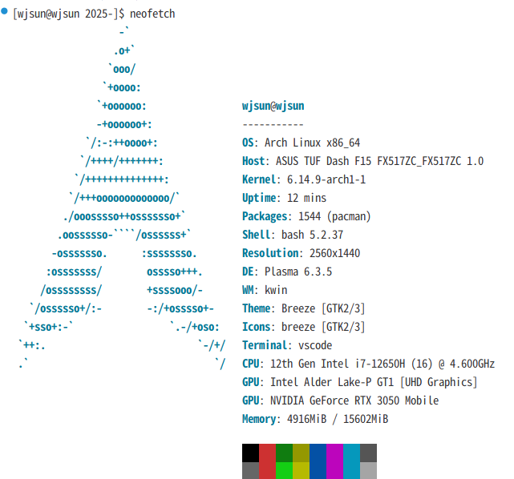

# 2025- 项目概览

这个仓库包含多个密码学和数字水印项目，每个项目专注于不同的安全和数据完整性方面。以下是主要项目的概述。

## 环境信息

### 当前系统环境


### 软件依赖
- **CMake**: 3.30.3
- **GCC/Clang**: GCC 7.5 或更高版本
- **Python**: Python 3.x

## 项目概览

### 项目1: SM4 实现
- **描述**: 包含SM4块密码算法的多种实现，包括使用T表优化性能的版本。
- **主要功能**:
  - 标准SM4实现（`sm4.c`，`sm4.h`）
  - T表优化实现（`sm4_withTtable.c`）
  - GCM模式实现（`sm4_gcm.c`）
  - 测试和演示文件（`sm4_test`，`main.c`）
  - 构建生成文件（`libsm4.a`，`libsm4ttable.a`，`sm4_demo`）
- **目的**: 提供高效且优化的SM4算法实现，适用于各种用例。

### 项目2: DWT-SVD 数字水印
- **描述**: 实现使用离散小波变换（DWT）和奇异值分解（SVD）的一种数字水印系统。
- **主要功能**:
  - 水印嵌入和提取（`embedding_howimetyourmark.py`，`detection_howimetyourmark.py`）
  - 基准测试和攻击测试（`waterandbench.py`，`attacks.py`）
  - 实用函数（`utilities/`）
  - 示例图片（`lena.bmp`，`watermarked_lena.bmp`）
- **目的**: 演示一种强健的数字水印技术，能够抵抗各种攻击。

### 项目3: MyPoseidon2 零知识证明
- **描述**: 实现MyPoseidon2，一种用于零知识证明和zk-SNARKs的库。
- **主要功能**:
  - 电路定义（`myposeidon2.circom`）
  - 证人生成和证明验证
  - JavaScript绑定（`myposeidon2_js/`）
  - 依赖项和构建生成文件
- **目的**: 提供构造和验证零知识证明的工具，适用于隐私保护应用。

### 项目4: SM3 实现
- **描述**: 包含多种SM3加密哈希函数的实现。
- **主要功能**:
  - 基础实现（`sm3_base.c`）
  - 并行实现（`sm3_parallel.c`）
  - 基准测试工具（`sm3_benchmark`）
  - 构建生成文件和配置文件
- **目的**: 提供高效且可扩展的SM3算法实现，适用于各种应用。

### 项目6: Google Password Checkup验证
- **描述**: 包含不同密码学和算法研究的各种实现文件。
- **主要功能**:
  - Python实现（`implement.py`）
  - C实现（`gen`，`T-tablegen.c`）
- **目的**: 服务于实验性和概念验证的实现。

## 编译与运行

### C项目编译
```bash
mkdir build
cd build
cmake ..
make
```

### Python脚本运行
```bash
python3 embedding_howimetyourmark.py
```